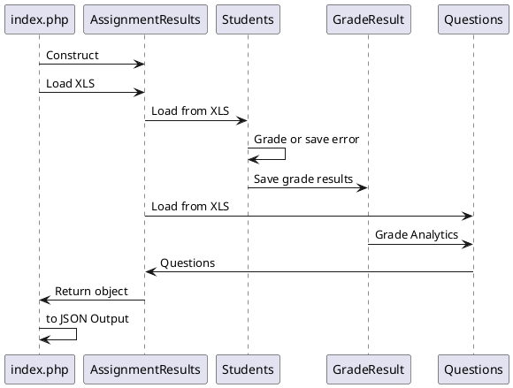

# Test
I will divide the test in 2 different sections:
- Grade results based on configurable scale.
- Provide analytics based on test data and grade results

I tried keeping it flexible for future changes since the were a couple of uncertainties for example:
- Linear scale for score -> grade correlation
- student or examinator responsible for grading call
- p-value would be nice to have some validation
- r-value is probably incorrect.

##Grade interpolation
```
// Interpolate score/maxScore percentage to grade
$gradeInterPoints = [
    [0, 1],
    [20, 1],
    [70, 5.5],
    [100, 10],
];
```

##P-value
```
    $pValue = $avgScore / $maxQuestion Score;
```

##R-value
```
    $rValue = Correlation::r($assignmentScores, $questionAnswerScores);
```


##Basic Class Relation Diagram



##Usage:
```
composer install
php index.php
```

##Example Output:
- [output.json](output.json)

##Sources:
- [index.php](index.php)
- [AssignmentResult.php](App/Remindo/AssignmentResults.php)
- [Student.php](App/Remindo/Student.php)
- [Question.php](App/Remindo/Question.php)
- [GradeResult.php](App/Remindo/GradeResult.php)


##Timeline
- 20 min Read assignment and analyze data.
- 10 min Find new math api for PHP.
- 10 min Find new XLS api for PHP.
- 15 min Setup project + composer.
         Add assignment, Question, Student, GradeResult and index.php.
- 25 min testing with hardcoded objects and grade calculation.
- 10 min move grade calculation from assignment to Student and small refactors.
- 10 min test with XLS importer.
- 10 min add messages and extra checks before grade calculation.
- 15 min focus on pValue and rValue
- 20 min testing / code cleanup / doc blocks.
- 15 min readme.md update.

##Conclusion
I might try different Math and XLS dependencies for a next project.
Would really like some more time to test r-value or validate against known data.
